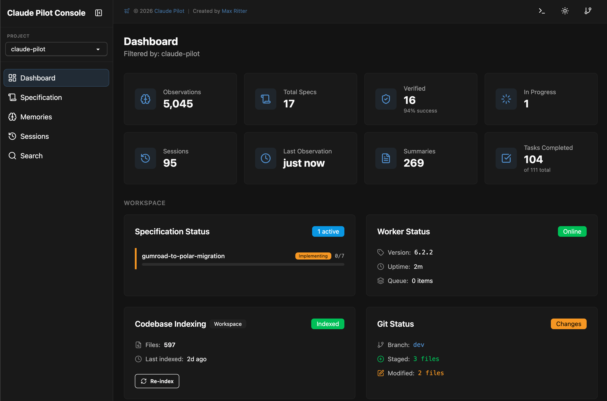

<div align="center">


### Claude Code is powerful. Pilot makes it reliable.

Ship code you can actually trust. Pilot is your quality autopilot.</br>
**Tests enforced. Context preserved. Quality automated.**

[](https://github.com/maxritter/claude-pilot/releases)
[](https://github.com/maxritter/claude-pilot/stargazers)
[](https://github.com/maxritter/claude-pilot/commits/main)
[](https://github.com/maxritter/claude-pilot/pulls)
[](https://star-history.com/#maxritter/claude-pilot&Date)

⭐ [Star this repo](https://github.com/maxritter/claude-pilot) · 🌐 [Website](https://www.claude-pilot.com) · 🔔 [Follow for updates](https://www.linkedin.com/in/rittermax/) · 📋 [Changelog](https://pilot.openchangelog.com/) · 📄 [License](LICENSE)

<br>

```bash
curl -fsSL https://raw.githubusercontent.com/maxritter/claude-pilot/main/install.sh | bash
```

**Works on macOS, Linux, and Windows (WSL2).**

<br>


</div>

---

## Why I Built This

I'm a senior IT freelancer from Germany. My clients hire me to ship production-quality code — tested, typed, formatted, and reviewed. When something goes into production under my name, quality isn't optional.

Claude Code writes code fast. But without structure, it skips tests, loses context, and produces inconsistent results. I tried other frameworks — they burned tokens on bloated prompts without adding real value. Some added process without enforcement. Others were prompt templates that Claude ignored when context got tight. None made Claude reliably produce production-grade code.

So I built Pilot. Instead of adding process on top, it bakes quality into every interaction. Linting, formatting, and type checking run as enforced hooks on every edit. TDD is mandatory, not suggested. Context is monitored and preserved across sessions. Every piece of work goes through verification before it's marked done.

---

## Before & After

| Without Pilot              | With Pilot                                                      |
| -------------------------- | --------------------------------------------------------------- |
| Writes code, skips tests   | TDD enforced — RED, GREEN, REFACTOR on every feature            |
| No quality checks          | Hooks auto-lint, format, type-check on every file edit          |
| Context degrades mid-task  | Endless Mode with automatic session handoff                     |
| Every session starts fresh | Persistent memory across sessions via Pilot Console             |
| Hope it works              | Verifier sub-agents perform code review before marking complete |
| No codebase knowledge      | Production-tested rules loaded into every session               |
| Generic suggestions        | Coding skills activated dynamically when relevant               |
| Changes mixed into branch  | Isolated worktrees — review and squash merge when verified      |
| Manual tool setup          | MCP servers + language servers pre-configured and ready         |

---

## Why This Approach Works

There are other AI coding frameworks out there. I tried them. They add complexity — dozens of agents, elaborate scaffolding, thousands of lines of instruction files — but the output doesn't improve proportionally. More machinery burns more tokens, increases latency, and creates more failure modes. Complexity is not a feature.

**Pilot optimizes for output quality, not system complexity.** The rules are minimal and focused. There's no big learning curve, no project scaffolding to set up, no state files to manage. You install it, run `pilot`, and the quality guardrails are just there — hooks, TDD, type checking, formatting — enforced automatically on every edit, in every session.

This isn't a vibe coding tool. It's built for developers who ship to production and need code that actually works. Every rule in the system comes from daily professional use: real bugs caught, real regressions prevented, real sessions where the AI cut corners and the hooks stopped it. The rules are continuously refined based on what measurably improves output.

The system stays fast because it stays simple. Quick mode is direct execution with zero overhead — no sub-agents, no plan files, no directory scaffolding. You describe the task and it gets done. `/spec` adds structure only when you need it: plan verification, TDD enforcement, independent code review, parallel execution. Both modes share the same quality hooks. Both modes hand off cleanly across sessions with Endless Mode.

---

## Getting Started

### Prerequisites

**Claude Subscription:** [Max](https://claude.com/pricing), [Team Premium](https://claude.com/pricing#team-&-enterprise), or [Enterprise](https://claude.com/pricing#team-&-enterprise) recommended; using the API may lead to much higher costs

### Installation

`cd` into your project folder, then run:

```bash
curl -fsSL https://raw.githubusercontent.com/maxritter/claude-pilot/main/install.sh | bash
```

**Choose your environment:**

- **Local Installation** — Install directly on your system using Homebrew. Works on macOS, Linux, and Windows (WSL2).
- **Dev Container** — Pre-configured, isolated environment with all tools ready. No system conflicts and works on any OS.

After installation, run `pilot` or `ccp` in your project folder to start Claude Pilot.

<details>
<summary><b>What the installer does</b></summary>

8-step installer with progress tracking, rollback on failure, and idempotent re-runs:

1. **Prerequisites** — Checks Homebrew, Node.js, Python 3.12+, uv, git
2. **Dependencies** — Installs Vexor, playwright-cli, mcp-cli, Claude Code
3. **Shell integration** — Auto-configures bash, fish, and zsh with `pilot` alias
4. **Config & Claude files** — Sets up `.claude/` plugin, rules, skills, hooks, MCP servers
5. **VS Code extensions** — Installs recommended extensions for your stack
6. **Dev Container** — Auto-setup with all tools pre-configured
7. **Automated updater** — Checks for updates on launch with release notes and one-key upgrade
8. **Cross-platform** — macOS, Linux, Windows (WSL2)

</details>

### Installing a Specific Version

If the current version has issues, you can install a specific stable version (see [releases](https://github.com/maxritter/claude-pilot/releases)):

```bash
export VERSION=6.3.0
curl -fsSL https://raw.githubusercontent.com/maxritter/claude-pilot/main/install.sh | bash
```

---

## How It Works

### /sync — Sync Rules & Skills

Run `/sync` to sync custom rules and skills with your codebase. Explores your codebase, builds a semantic search index, discovers undocumented patterns, updates project documentation, and creates new skills. Run it once initially, then anytime again:

```bash
pilot
> /sync
```

<details>
<summary><b>What <code>/sync</code> does in detail</b></summary>

| Phase | Action                                                          |
| ----- | --------------------------------------------------------------- |
| 0     | Load reference guidelines, output locations, error handling     |
| 1     | Read existing rules and skills from `.claude/`                  |
| 2     | Build Vexor semantic search index (first run may take 5-15 min) |
| 3     | Explore codebase with Vexor/Grep to find patterns               |
| 4     | Compare discovered vs documented patterns                       |
| 5     | Sync/update `project.md` with tech stack and commands           |
| 6     | Sync MCP server documentation                                   |
| 7     | Update existing skills that have changed                        |
| 8     | Discover and document new undocumented patterns as rules        |
| 9     | Create new skills via `/learn` command                          |
| 10    | Report summary of all changes                                   |

</details>

### /spec — Spec-Driven Development

Best for complex features, refactoring, or when you want to review a plan before implementation:

```bash
pilot
> /spec "Add user authentication with OAuth and JWT tokens"
```

```
Discuss  →  Plan  →  Approve  →  Implement  →  Verify  →  Done
                                     │              ↑       ↓
                                     │              └─ Loop─┘
                                     │
                            ┌────────┼────────┐
                            ▼        ▼        ▼
                         Task 1   Task 2   Task 3    ← parallel waves
                         (TDD)    (TDD)    (TDD)       for independent
                            │        │        │          tasks
                            └────────┼────────┘
                                     ▼
                              Merge & Verify
```

<details>
<summary><b>Plan Phase</b></summary>

1. Explores entire codebase with semantic search (Vexor)
2. Asks clarifying questions before committing to a design
3. Writes detailed spec to `docs/plans/` as reviewed markdown with scope, tasks, and definition of done
4. **Plan-verifier sub-agent** independently validates completeness and alignment with your request
5. Auto-fixes any issues found by the verifier
6. Waits for your approval — you can edit the plan first

</details>

<details>
<summary><b>Implement Phase</b></summary>

1. Creates an isolated git worktree on a dedicated branch — main branch stays clean
2. Analyzes task graph to detect independent tasks — groups them into parallel waves
3. Spawns `spec-implementer` sub-agents for each independent task in a wave, executing TDD in parallel with fresh context windows
4. Falls back to sequential execution only when tasks share files or have linear dependencies
5. Each task follows strict TDD: write failing test (RED), implement to pass (GREEN), refactor (REFACTOR)
6. Quality hooks auto-lint, format, and type-check every file edit
7. After each wave, runs the full test suite to catch cross-task conflicts before proceeding

</details>

<details>
<summary><b>Verify Phase</b></summary>

1. Runs full test suite — unit, integration, and E2E
2. Type checking and linting across the entire project
3. Executes actual program to verify real-world behavior (not just tests)
4. **Spec-verifier sub-agent** performs independent code review against the plan
5. Auto-fixes all findings, then re-verifies until clean
6. Loops back to implementation if structural issues remain
7. On success, shows diff summary and offers to squash merge worktree back to main branch

</details>

### Quick Mode

Just chat. No plan file, no approval gate. All quality hooks and TDD enforcement still apply.

```bash
pilot
> Fix the null pointer bug in user.py
```

### /learn — Online Learning

Capture non-obvious discoveries as reusable skills. Triggered automatically after 10+ minute investigations, or manually:

```bash
pilot
> /learn "Extract the debugging workflow we used for the race condition"
```

### /vault — Team Vault

Share rules, commands, and skills across your team via a private Git repository:

```bash
pilot
> /vault
```

- **Private** — Use any Git repo (GitHub, GitLab, Bitbucket — public or private)
- **Pull** — Install shared assets from your team's vault
- **Push** — Share your custom rules and skills with teammates
- **Version** — Assets are versioned automatically (v1, v2, v3...)

### Rules, Commands & Skills

Create your own in your project's `.claude/` folder:

| Type         | Loaded                            | Best for                                 |
| ------------ | --------------------------------- | ---------------------------------------- |
| **Rules**    | Every session (always in context) | Guidelines Claude should always follow   |
| **Commands** | On demand via `/command`          | Specific workflows or multi-step tasks   |
| **Skills**   | Dynamically when relevant         | Specialized knowledge for specific tasks |

Claude Pilot automatically installs best-practice rules, commands, and coding standard skills.

### Custom MCP Servers

Add your own MCP servers in two locations:

| Config File        | How It Works                                         | Best For                        |
| ------------------ | ---------------------------------------------------- | ------------------------------- |
| `.mcp.json`        | Instructions load into context when triggered        | Lightweight servers (few tools) |
| `mcp_servers.json` | Called via mcp-cli; instructions never enter context | Heavy servers (many tools)      |

Run `/sync` after adding servers to generate documentation.

---

## Under the Hood

### The Hooks Pipeline

**Hooks** fire automatically at every stage of development:

#### SessionStart (on startup, clear, or compact)

| Hook            | Type     | What it does                                       |
| --------------- | -------- | -------------------------------------------------- |
| Memory loader   | Blocking | Loads persistent context from Pilot Console memory |
| Session tracker | Async    | Initializes user message tracking for the session  |

#### PostToolUse (after every Write / Edit / MultiEdit)

After **every single file edit**, these hooks fire:

| Hook                     | Type         | What it does                                                                                                                                                         |
| ------------------------ | ------------ | -------------------------------------------------------------------------------------------------------------------------------------------------------------------- |
| `file_checker_python.py` | Blocking     | Runs ruff format + lint + basedpyright type checking on `.py` files. Auto-fixes formatting and common lint issues.                                                   |
| `file_checker_ts.py`     | Blocking     | Runs Prettier + ESLint + type checking on `.ts`/`.tsx` files. Auto-fixes formatting and common issues.                                                               |
| `file_checker_go.py`     | Blocking     | Runs gofmt + golangci-lint + type checking on `.go` files. Auto-fixes formatting.                                                                                    |
| `tdd_enforcer.py`        | Non-blocking | Checks if implementation files were modified without failing tests first. Shows reminder to write tests. Excludes test files, docs, config, TSX, and infrastructure. |
| Memory observer          | Async        | Captures development observations to persistent memory.                                                                                                              |
| `context_monitor.py`     | Non-blocking | Monitors context window usage. Warns as usage grows, forces handoff before hitting limits. Caches for 15 seconds to avoid spam.                                      |

#### PreToolUse (before search, web, or task tools)

| Hook               | Type     | What it does                                                                                                                                                   |
| ------------------ | -------- | -------------------------------------------------------------------------------------------------------------------------------------------------------------- |
| `tool_redirect.py` | Blocking | Routes WebSearch, WebFetch, Grep, Task, and plan mode tools to appropriate contexts. Prevents tools from being accidentally lost during plan/implement phases. |

#### Stop (when Claude tries to finish)

| Hook                 | Type     | What it does                                                                                                                               |
| -------------------- | -------- | ------------------------------------------------------------------------------------------------------------------------------------------ |
| `spec_stop_guard.py` | Blocking | If an active spec exists with PENDING or COMPLETE status, **blocks stopping**. Forces verification to complete before the session can end. |
| Session summarizer   | Async    | Saves session observations to persistent memory for future sessions.                                                                       |

### Endless Mode

The context monitor tracks usage in real-time and manages multi-session continuity:

- As context grows, Pilot warns, then forces a handoff before hitting limits
- Session state is saved to `~/.pilot/sessions/` with continuation files — picks up seamlessly in the next session
- During `/spec`, Pilot won't start a new phase when context is high — it hands off instead
- Multiple Pilot sessions can run in parallel on the same project without interference
- Status line shows live context usage, memory status, active plan, and license info

### Built-in Rules

Production-tested best practices loaded into **every session**. These aren't suggestions — they're enforced standards.

<details>
<summary><b>Quality Enforcement (4 rules)</b></summary>

- `tdd-enforcement.md` — Mandatory RED → GREEN → REFACTOR cycle with verification checklist
- `verification-before-completion.md` — Never mark task complete without full verification
- `execution-verification.md` — How to verify code actually works (run it, test it, smoke test it)
- `workflow-enforcement.md` — Systematic approach to problem-solving

</details>

<details>
<summary><b>Context Management (3 rules)</b></summary>

- `context-continuation.md` — Endless Mode protocol (thresholds, handoff format, multi-session parallel)
- `memory.md` — 3-layer persistent memory workflow (search → timeline → observations)
- `coding-standards.md` — General naming, organization, documentation, performance

</details>

<details>
<summary><b>Language Standards (3 rules)</b></summary>

- `python-rules.md` — uv for packages, pytest for testing, ruff for linting, basedpyright for types
- `typescript-rules.md` — npm/pnpm, Jest, ESLint, Prettier, React component patterns
- `golang-rules.md` — Go modules, testing conventions, code organization, common patterns

</details>

<details>
<summary><b>Tool Integration (6 rules)</b></summary>

- `vexor-search.md` — Semantic code search: indexing, querying, token-efficient retrieval
- `context7-docs.md` — Library documentation: fetching API docs for any dependency
- `grep-mcp.md` — GitHub code search: finding real-world usage patterns across repos
- `web-search.md` — Web search via DuckDuckGo, Bing, Exa with query syntax and filtering
- `playwright-cli.md` — Browser automation for E2E UI testing with page navigation, screenshots, tracing, and network mocking
- `mcp-cli.md` — MCP command line: listing servers, running tools, custom configuration

</details>

<details>
<summary><b>Development Workflow (6 rules)</b></summary>

- `git-operations.md` — Commit messages, branching strategy, PR workflow
- `gh-cli.md` — GitHub CLI: issues, PRs, releases, code search
- `systematic-debugging.md` — Root cause analysis, hypothesis testing, minimal reproducible examples
- `testing-strategies-coverage.md` — Unit vs integration vs E2E, coverage metrics, mock strategies
- `learn.md` — Online learning system: when and how to extract knowledge into skills
- `team-vault.md` — Team Vault: sx usage patterns, asset scoping, versioning, error handling

</details>

### Built-in Coding Skills

Dynamically activated when relevant — specialized knowledge loaded on demand:

| Skill                | Coverage                                                         |
| -------------------- | ---------------------------------------------------------------- |
| Python Standards     | uv, pytest, ruff, basedpyright, type hints, docstrings           |
| TypeScript Standards | npm/pnpm, Jest, ESLint, Prettier, React patterns                 |
| Go Standards         | Modules, testing, formatting, error handling                     |
| Testing Patterns     | Unit testing, integration testing, mocking, coverage goals       |
| Test Organization    | File structure, naming conventions, fixtures, setup              |
| API Design           | RESTful patterns, response envelopes, error handling, versioning |
| Data Models          | Database schemas, type safety, migrations, relationships         |
| Components           | Reusable patterns, props design, documentation, testing          |
| CSS / Styling        | Naming conventions, organization, responsive design, performance |
| Responsive Design    | Mobile-first, breakpoints, Flexbox/Grid, touch interactions      |
| Design System        | Color palette, typography, spacing, component consistency        |
| Accessibility        | WCAG compliance, ARIA attributes, keyboard nav, screen readers   |
| DB Migrations        | Schema changes, data transformation, rollback strategy           |
| Query Optimization   | Indexing, N+1 problems, query patterns, performance              |

### MCP Servers

External context always available to every session:

| Server         | Purpose                                                          |
| -------------- | ---------------------------------------------------------------- |
| **Context7**   | Library documentation lookup — get API docs for any dependency   |
| **mem-search** | Persistent memory search — recall context from past sessions     |
| **web-search** | Web search via DuckDuckGo, Bing, and Exa                         |
| **grep-mcp**   | GitHub code search — find real-world usage patterns across repos |
| **web-fetch**  | Web page fetching — read documentation, APIs, references         |

### Language Servers (LSP)

Real-time diagnostics and go-to-definition, auto-installed and configured:

| Language       | Server       | Capabilities                                                                         |
| -------------- | ------------ | ------------------------------------------------------------------------------------ |
| **Python**     | basedpyright | Strict type checking, diagnostics, go-to-definition. Auto-restarts on crash (max 3). |
| **TypeScript** | vtsls        | Full TypeScript support with Vue compatibility. Auto-restarts on crash (max 3).      |
| **Go**         | gopls        | Official Go language server. Auto-restarts on crash (max 3).                         |

All configured via `.lsp.json` with stdio transport.

---

## Claude Pilot Console

Access the web-based Claude Pilot Console at **http://localhost:41777** to visualize your development workflow:



---

## What Users Say

<!-- Replace with real testimonials from GitHub issues, discussions, or direct feedback as they come in -->

> "I stopped reviewing every line Claude writes. The hooks catch formatting and type errors automatically, TDD catches logic errors, and the spec verifier catches everything else. I review the plan, approve it, and the output is production-ready."

> "Other frameworks I tried added so much overhead that half my tokens went to the system itself. Pilot is lean — quick mode has zero scaffolding, and even /spec only adds structure where it matters. More of my context goes to actual work."

> "Endless Mode solved the problem I didn't know how to fix. Complex refactors used to stall at 60% because Claude lost track of what it was doing. Now it hands off cleanly and the next session picks up exactly where the last one stopped."

_Using Pilot professionally? [Share your experience](https://github.com/maxritter/claude-pilot/issues) or reach out on [LinkedIn](https://www.linkedin.com/in/rittermax/)._

---

## License

Claude Pilot is source-available under a commercial license. See the [LICENSE](LICENSE) file for full terms.

| Tier     | Seats | Includes                                                                  |
| :------- | :---- | :------------------------------------------------------------------------ |
| **Solo** | 1     | All features, continuous updates, GitHub support                          |
| **Team** | Multi | Solo + multiple seats, dedicated email support, priority feature requests |

Details and licensing at [claude-pilot.com](https://www.claude-pilot.com).

---

## Changelog

See the full changelog at [pilot.openchangelog.com](https://pilot.openchangelog.com/).

---

## Contributing

**Pull Requests** — New features, improvements, and bug fixes are welcome. You can improve Pilot with Pilot — a self-improving loop where your contributions make the tool that makes contributions better.

**Issues** — Found a bug or have a feature request? [Open an issue](https://github.com/maxritter/claude-pilot/issues).

---

<div align="center">

**Claude Code is powerful. Pilot makes it reliable.**

</div>
